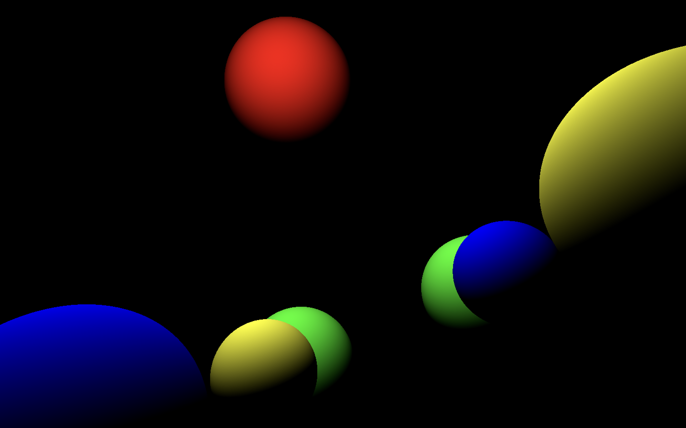

This is my WIP attempt at implementing a 3D renderer.

## Usage

Build and run, I recommend in release mode.
```bash
cargo run --release
```

Controls:
* `Ctrl-c`: Exit
* `w`: Move forward
* `s`: Move backward
* `a`: Move left
* `d`: Move right
* `q`: Move down
* `e`: Move up
* `i`: Look up
* `k`: Look down
* `j`: Look left
* `l`: Look right
* `u`: Roll left
* `o`: Roll right
* `r`: Increase focal length
* `f`: Decrease focal length
* `z`: Dolly zoom in
* `x`: Dolly zoom out

Note that all controls are relative to the camera's current orientation.
